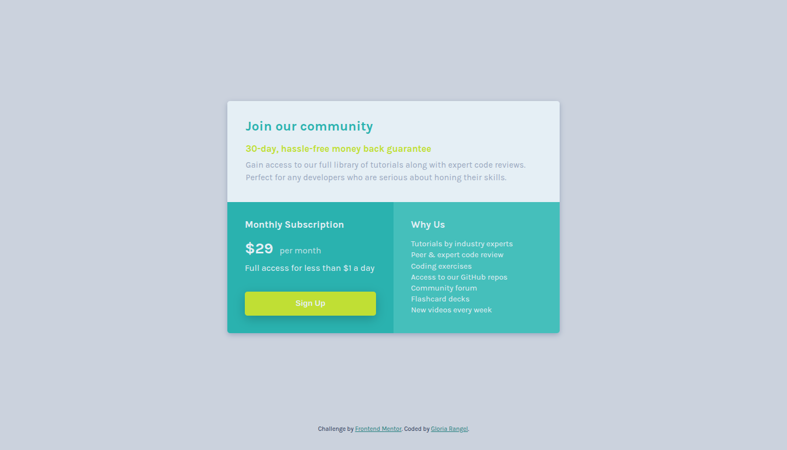

# 🖼 Frontend Mentor - Single price grid component solution

This is a solution to the [Single price grid component challenge on Frontend Mentor](https://www.frontendmentor.io/challenges/single-price-grid-component-5ce41129d0ff452fec5abbbc). Frontend Mentor challenges help you improve your coding skills by building realistic projects. 

##  📋 Table of contents

-  Overview

-  Screenshot

-  Links

-  My process

-  Built with

-  Useful resources

- What I learned

-  Author

-  Thanks

##  📖 Overview

In this challenge, you will be creating a pricing component based on the provided design mockups. This is an excellent opportunity for beginners or anyone looking to complete a smaller, more focused project. The main objective is to replicate the design as closely as possible, paying attention to the details and ensuring a clean, professional look.

The component must be fully **responsive**, adjusting to different screen sizes and devices. A key requirement for this challenge is to use *CSS Grid* to lay out the component. This will help you practice creating a flexible, grid-based design structure that adapts seamlessly across different viewports.

**The main tasks for this challenge include:**

-  Implementing a responsive layout that adjusts based on the user’s device screen size.
-  Ensuring hover and focus states for all interactive elements to improve usability and **accessibility**.
-  Using CSS Grid to structure the layout, ensuring a clean and adaptable design.

By the end of this challenge, you should have a fully functional, visually accurate pricing component ready for use across various screen sizes.

###  📸 Screenshot

These are the screenshots of the implemented solution:

-  **🖥️ Desktop version**

-  **👆 Hover**  

-  **📱 Mobile version**

###  ⛓️ Links

-  HTML URL: [index.html](https://github.com/NorimNori/single-price-grid-component/blob/main/index.html)

-  Styles URL: [styles folder](https://github.com/NorimNori/single-price-grid-component/tree/main/styles)

-  Live Site URL: [on Netlify](https://single-price-grid-component-by-gr.netlify.app/)

##  📌 My process

###  🪚 Built with

-  Semantic HTML5 markup

-  SCSS styles

-  Flexbox

-  CSS Grid

-  Mobile-first workflow

-  BEM class naming 

-  Local .ttf font for typography, loaded via @font-face.

###  🔬 What I learned

This challenge was more focused on practicing existing skills rather than learning completely new concepts. It gave me a great opportunity to refine my use of **CSS Grid**, especially the `grid-template-areas` property for layout management.

By using `grid-template-areas`, I was able to assign specific names to areas of the grid, which made it easier to place elements in a structured and intuitive way. This technique allowed me to create a clear and responsive design that adapts well to different screen sizes. Although I was familiar with CSS Grid before, this challenge helped me better understand how to leverage `grid-template-areas` for cleaner and more efficient layouts.

###  📝 Useful resources

-  [Grid areas](https://developer.mozilla.org/en-US/docs/Glossary/Grid_Areas) -  This link leads to the official MDN (Mozilla Developer Network) documentation on Grid Areas in CSS. It provides a comprehensive explanation of how grid-template-areas works in CSS Grid layout. The documentation outlines how to name different areas of a grid to simplify the placement of items within the grid. It includes clear examples, use cases, and best practices to help developers understand and implement grid areas efficiently, enhancing their ability to create structured and responsive layouts.

##  👋 Author

-  LinkedIn - [Gloria Rangel](https://www.linkedin.com/in/gloria-rangel-06b960306/)

-  Frontend Mentor - [@NorimNori](https://www.frontendmentor.io/profile/NorimNori)

##  🌟 Thank You 🌟

Thanks for visiting this repository! I hope you found it useful and inspiring, or it was just a fun time.

A special thanks to [Frontend Mentor](https://www.frontendmentor.io) for the challenge and for being such an amazing platform to learn and grow as a developer.

Have a nice day! 😊
